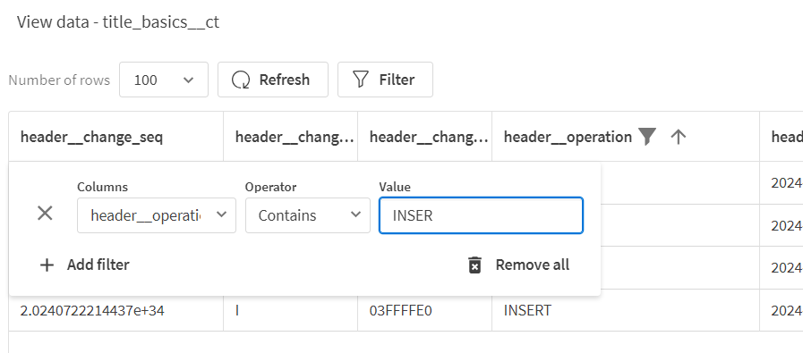
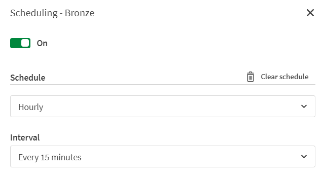

## Recommended Demo script
**Current status:** *development*

You can adapt this to your style, feel free to make changes

| Show this | Say this |
| :-------------------- | :------------- |
| Open your tenant home  | Today's businesses require real-time data delivery and low-code data transformations for strategic initiatives. This involves onboarding data from various sources, transforming it with best-practice architectures, and using push-down SQL to leverage scalable cloud data platforms like Databricks. In this demo, I will guide you through a SaaS-based data transformation pipeline, from source to dashboard, highlighting its flexibility and automation capabilities. I will demonstrate how Qlik provides an end-to-end solution within a single platform, enabling organizations to create and manage data pipelines using the Databricks Data Platform. Specifically, I will show how to use a movies database to build a medallion architecture on Databricks, making it AI-ready. |
| Show the left navigation pane | You can see that in the same console we have Analytics and Data Integration |
| Click on the **Data Integration** icon and then **Home** | Let me show you what options we have on the Data Integration part, here we can create spaces to manage security, segregating access to different roles, groups and users. We can create connections to securely grant access to data engineers and data pipelines, which we are interested so far. | 
| Click on the Data project | Now, let me demonstrate how this pipeline was created. It extracts data in real-time from a database, captures any changes made to the database, and applies them to Databricks into the bronze layer. The same pipeline is applying no-code transformations to the data ensuring the data is ready for AI initiatives or analytics. |
| Show the 4 tasks | Each block you are seeing has a special purpose. The Landing task captures both the historical data and the changes and provision that data in Databricks in a very efficient way |
| Click on the Landing task and go to the **Monitor** view | Let me show how this happen. I can see here in my Full Load status how much time was consumed to bring all the historical data and in the same screen in the CDC Status I can see that my task is monitoring all the changes that are being made to the database. All inserts, updates and deletes are captured in seconds and applied to Databricks |
| Switch to **Design** view, and them **Physical** tables | I can see that each table in my source has a corresponding pair in Databricks, one for initial full load and other for all the changes. For example, when I click on the title_basics_ct table, I can view all the changes applied to that table using the "View data" option.|
| Press the **View data** on the title_basics_ct table| We can see here the updates and inserts executed on that table. *You can filter for inserts for example if you wish*  | 
| Navigate back to the project view and open the Bronze task | Now, let's see how Qlik Talend consolidates these table pairs into a single table with up-to-date data. |
|Expand the Scheduling section | Data engineers can determine the frequency of consolidating changes in the Bronze layer, whether it be every few minutes, hourly, or daily. This decision should balance resource consumption and latency needs.  |