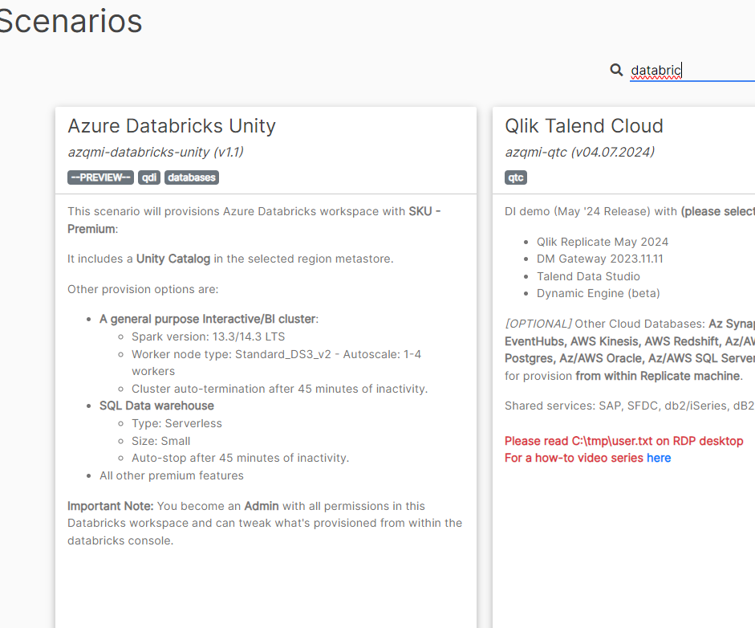
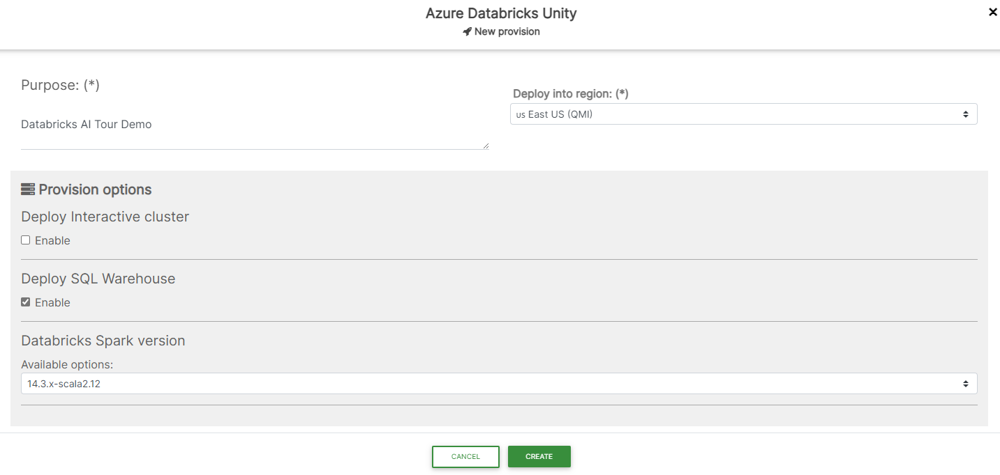

## How to provision your Databricks Instance

1. Navigate to [QMI Cloud Scenarios](https://qmicloud.qliktech.com/scenarios) with your credentials
2. Search for "Databricks" 

3. Press the **Provision** Button
4. Give your instance a name, select **US East US (QMI)** region and untick *Deploy Interactive cluster* (we don´t need one)

5. Press **Create** button and wait for a few minutes
   
---
    END OF SESSION
---