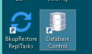
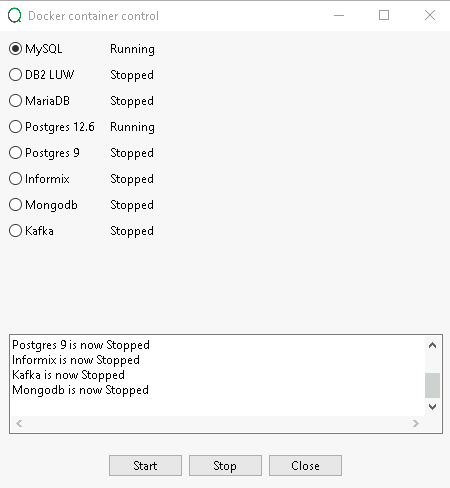
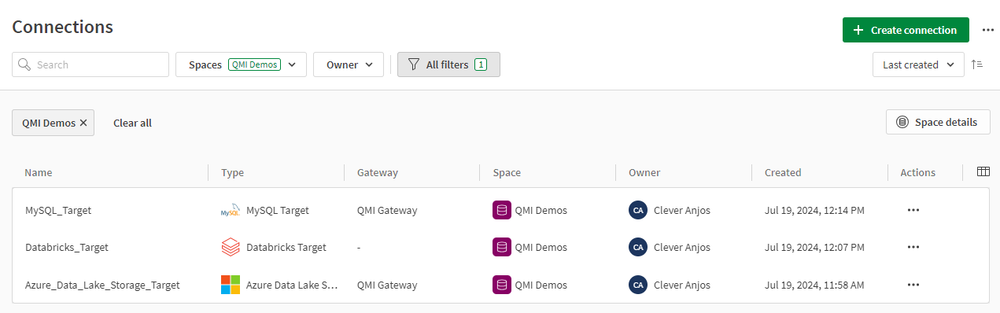

# Demo Guide for Data AI World Tour 2024
**Current status:** *development*

## Asssets
*You can use the silent videos and use your own voice*
1. [AI-Ready Data Silent video](https://qliktechnologies365.sharepoint.com/:v:/r/sites/QlikPartnerEngineering/Shared%20Documents/Partners/Databricks/DAIS%20Tour/Videos/DAIS%20Tour%20-%20AI%20Ready%20Data%20silent%20video.mp4?csf=1&web=1&e=AreTFX)
2. [AI-Ready Data Demo] - Self contained demo
3. [AI-Ready Intro Slides](https://qliktechnologies365-my.sharepoint.com/:p:/r/personal/cuv_qlik_com1/Documents/2024-%20Qlik%20Databricks%20AI%20Tour%20.pptx?d=wc17d44efc5ac455ea389b883d723e252&csf=1&web=1&e=EcURER)
4. [Qlik Analytics integrated with Vector Search silent video](https://qliktechnologies365.sharepoint.com/:v:/r/sites/QlikPartnerEngineering/Shared%20Documents/Partners/Databricks/DAIS%20Tour/Videos/DAIS%20Tour%20-%20Qlik%20Analytics%20with%20Vector%20Search%20silent%20video.mp4?csf=1&web=1&e=hQ4F0L)
5. [Qlik Analytics integrated with Vector Search demo video]
6. [Qlik Analytics integrated with Vector Search demo app](https://partner-engineering-saas.us.qlikcloud.com/sense/app/51821a53-b221-4832-9b58-4f1abe228832)
7. [Databricks Cost Explorer video]
8. [Databricks Cost Explorer App](https://partner-engineering-saas.us.qlikcloud.com/sense/app/45caed3d-4a37-4541-9528-c592fc337dc0/overview)
9. [SAP Accelerators Video Demo](https://qliktechnologies365-my.sharepoint.com/:v:/r/personal/cuv_qlik_com1/Documents/file%20transfer/SAP%20Accelerators%20Databricks.mp4?csf=1&web=1&e=v4sHno)
10. [SAP Accelerators Blog Post](https://www.qlik.com/blog/7-easy-steps-to-accelerate-sap-data-replication-in-real-time-in-databricks)
11. [Data Pipeline Project](Databricks%20AI%20Tour_Data%20pipeline_Databricks.json)

**Do your own demo**

## Preparation

### You will need:
 
1\. [QMI instances](https://qmicloud.qliktech.com/): 

&emsp;1.1\. Qlik Talend Cloud instance with On-Prem Databases - Docker  **OR** any MySQL database that you have access using a DM Gateway

&emsp;1.2\. Databricks Instance [How to Provision](Provision/1-QMI-Databricks.md)
    
2\. MySQL Northwind 

3\. Qlik Talend Data Integration tenant
 

### 1 - Database start

1. RDP to your QMI Qlik Talend Cloud instance
2. Click on the **Database Control** icon

3. Select the MySQL option and press the **Start Button**

   

**Optional:** you can use this script to add events that wilk make changes to the database so you don´t need to apply changes manually.

### 2 - Creating the Connections

1\. Navigate to your Qlik Talend Data Integration

2\. Create the following connections, it´s recommended to have them in the same space:

&emsp;2.1\. **Databricks** using the credentials provided by [QMI Cloud](https://qmicloud.qliktech.com/provisions). Please pay attention to use the catalog provided to your user as described in the QMI Cloud *Provision Information**

&emsp;2.2\. **ADLS** using the credentials provided by [QMI Cloud](https://qmicloud.qliktech.com/provisions) 

&emsp;2.3\. **MySQL** using the credentials provided by the QMI Cloud Talend Cloud instance user.txt file (usually opened in the Notepad++), hostname is **mysql.attunitydemo.com** and the user is **root** 
'

3\. Check if you have all the three connections created

4\. Import the data pipeline [JSON](Data%20AI%20World%20Tour%202024.json) file to the same space. *You might need to reconfigure the connections to your project*

5\. Prepare and run all the tasks

You are now ready to deliver the demo using the [DemoScript](DemoScript.md)
