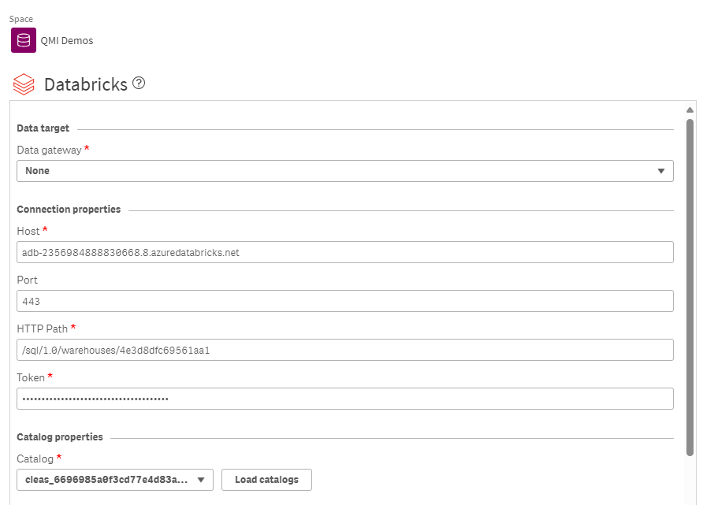
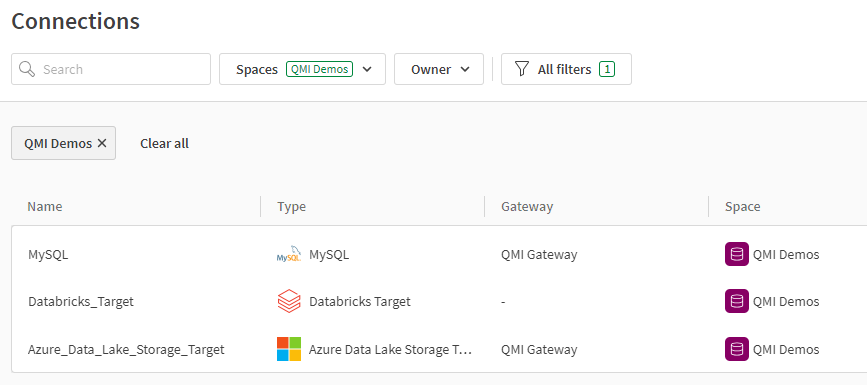

# Demo Guide for Data AI World Tour 2024

## Preparation

### You will need:
 
1\. [QMI instances](https://qmicloud.qliktech.com/): 
&emsp;1.1\. Qlik Talend Cloud instance with On-Prem Databases - Docker   **OR** any MySQL database that you have access using a DM Gateway
&emsp;1.2\. Databricks Instance [How to Provision](Provision/1-QMI-Databricks.md)
    
2\. MySQL database dump [download link](databasedump/movies.sql)

3\. Qlik Talend Data Integration tenant
 

### 1 - Database import

1. RDP to your QMI Qlik Talend Cloud instance
2. Click on the **Database Control** icon

3. Select the MySQL option and press the **Start Button**
   

1. Download the MySQL database dump 
2. Open the DBeaver client using the taskbar icon
3. Locate the MySQL 8+ connection and expand the **Databases** tree option d

7. Right-click and use the option **Create New Database** or press Alt+Insert key

8. Give *movies* as Database name and then press **OK**
9. Righ-click on the **movies** database icon and select the option **Tools/Restore Database**

10.  Use the **Browse** button to locate where you saved the file from step 4

11.  Press **Start** and wait for the completion (usually takes 40 seconds to complete)
12.  Validate if three tables were imported as the image below

13.  Validate if some events were added as the image below. *These events will automatically add/update/delete records to your database, to make the CDC part easier to demo*

### 2 - Creating the Connections

1\. Navigate to your Qlik Talend Data Integration

2\. Create the following connections, it´s recommended to have them in the same space:

&emsp;2.1\. **Databricks** using the credentials provided by [QMI Cloud](https://qmicloud.qliktech.com/provisions). Please pay attention to use the catalog provided to your user as described in the QMI Cloud *Provision Information**

&emsp;2.2\. **ADLS** using the credentials provided by [QMI Cloud](https://qmicloud.qliktech.com/provisions) 

&emsp;2.3\. **MySQL** using the credentials provided by the QMI Cloud Talend Cloud instance user.txt file (usually opened in the Notepad++), hostname is **mysql.attunitydemo.com**
'

3\. Check if you have all the three connections created

